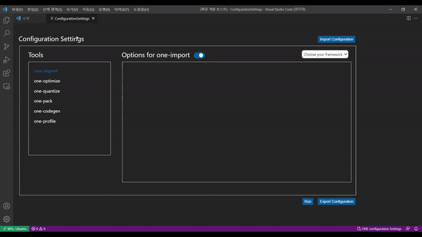

## Configuration-Setting GUI

This extension adds a gui configuration file setting for ONE developers. This includes:

- make new cfg file for ONE compiler
- import cfg file and revise it
- export cfg file
- run cfg file to make circle file

### Demo

### How to run

- `npm install`
- `npm run watch`

- Ctrl + Shift + P and type `one configuration-settings` or click `ONE configuration Settings` in status bar
